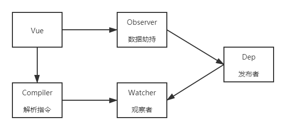
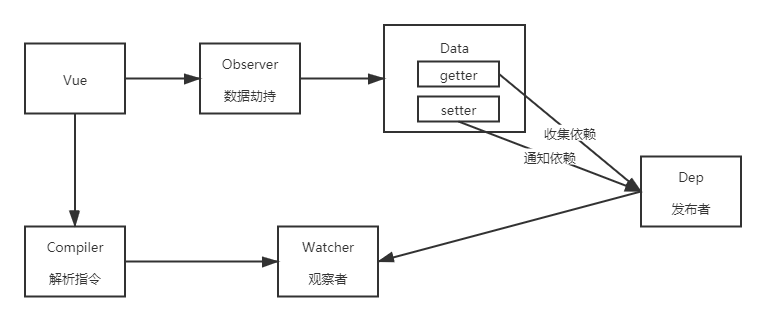
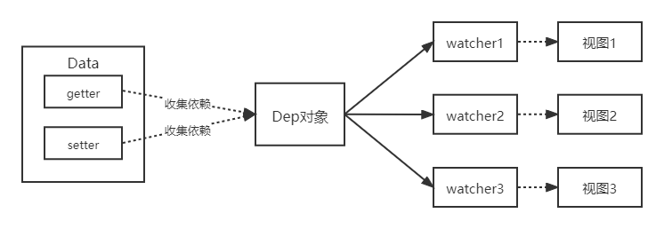

## 模拟实现 Vue 响应式

#### minivue 的基本结构


- **[Vue：](#1-vue)**
  - 把 `data` 中的成员注入到 `Vue` 实例，并且把 `data` 中的成员转成 `getter/setter`
- **[Observer：](#2-observer)**
  - 能够对数据对象的所有属性进行监听，如有变动可拿到最新值并通知 `Dep`
- **[Compiler：](#3-compiler)**
  - 解析每个元素中的指令/插值表达式，并替换成相应的数据
- **[Dep](#4-depdependency)**
  - 添加观察者 `watcher`，当数据变化通知所有观察者
- **[Watcher](#5-watcher)**
  - 数据变化更新视图

### 1. Vue
- 功能
  - 负责接收初始化的参数（选项）
  - 负责把 `data` 中的属性注入到 `Vue` 实例，转换成 `getter/setter`
  - 负责调用 `observer` 监听 `data` 中所有属性的变化
  - 负责调用 `compiler` 解析指令/插值表达式
- 结构
  | Vue |
  | --- |
  | + \$options <br> + \$el <br> + \$data |
  | - _proxyData() |
- 代码
```js
class Vue {
  constructor(options) {
    // 1. 通过属性保存选项的数据
    this.$options = options
    this.$data = options.data || {}
    this.$el = typeof options.el === 'string' ? document.querySelector(options.el) : options.el

    // 2. 把data中的成员转换成getter和setter，注入到vue实例中
    this._proxyData(this.$data)

    // 3. 调用observer对象，监听数据的变化
    // 4. 调用compiler对象，解析指令和差值表达式
  }

  _proxyData(data) {
    // 遍历data中的所有属性
    Object.keys(data).forEach(key => {
      // 把data的属性注入到vue实例中
      Object.defineProperty(this, key, {
        enumerable: true,
        configurable: true,
        get() {
          return data[key]
        },
        set(newValue) {
          if (newValue === data[key]) return

          data[key] = newValue
        }
      })
    })
  }
}
```

### 2. Observer
- 功能
  - 负责把 `data` 选项中的属性转换成响应式数据
  - `data` 中的某个属性也是对象，把该属性转换成响应式数据
  - 数据变化发送通知
- 结构
  | Observer |
  | --- |
  | + walk(data) <br> + defineReactive(data, key, value) |
- 代码
```js
// 负责数据劫持
// 把 $data 中的成员转换成getter/setter
class Observer {
  constructor(data) {
    this.walk(data)
  }

  walk(data) {
    // 1. 判断数据是否是对象，如果不是对象则返回
    if (!data || typeof data !== 'object') {
      return
    }
    
    // 2. 如果是对象，遍历对象的所有属性，设置为 getter/setter
    Object.keys(data).forEach(key => {
      this.defineReactive(data, key, data[key])
    })
  }

  defineReactive(data, key, val) {
    const that = this

    // 如果val是对象，把val内部的属性也转换成响应式数据
    this.walk(val)

    Object.defineProperty(data, key, {
      enumerable: true,
      configurable: true,
      get() {
        return val
      },
      set(newVal) {
        if (newVal === val) {
          return
        }
        val = newVal
        that.walk(newVal)
        // 发送通知...
      }
    })
  }
}
```

### 3. Compiler
- 功能
  - 负责编译模板，解析指令、差值表达式
  - 负责页面的首次渲染
  - 当数据变化后重新渲染视图
- 结构
  | Compiler |
  | --- |
  | + el <br> + vm |
  | + compiler(el) <br> + compileElement(node) <br> + compileText(node) <br> + isDirective(attrName) <br> + isTextNode(node) <br> + isElementNode(node) <br>  |
- 代码
**Compile**
```js
class Compiler {
  constructor(vm) {
    this.el = vm.$el
    this.vm = vm
    this.compile(this.el)
  }

  // 编译模板，处理文本节点和元素节点
  compile(el) {
    let childNodes = el.childNodes
    Array.from(childNodes).forEach(node => {
      if (this.isTextNode(node)) {
        // 处理文本节点
        this.compileText(node)
      } else if (this.isElementNode(node)) {
        // 处理元素节点
        this.compileElement(node)
      }

      // 判断node节点是否有子节点，如果有，则递归调用compile
      if (node.childNodes && node.childNodes.length) {
        this.compile(node)
      }
    })
  }

  // 编译元素节点，处理指令
  compileElement(node) {
    // console.log(node.attributes)
    // v-text v-model
    // 遍历所有的属性节点
    Array.from(node.attributes).forEach(attr => {
      // 判断是否是指令
      let attrName = attr.name
      if (this.isDirective(attrName)) {
        // v-text --> text
        attrName = attrName.substr(2)
        let key = attr.value
        this.update(node, key, attrName)
      }
    })
  }

  update(node, key, attrName) {
    let updateFn = this[attrName + 'Updater']
    updateFn && updateFn(node, this.vm[key])
  }

  // 处理 v-text 指令
  textUpdater(node, value) {
    node.textContent = value
  }

  // v-model
  modelUpdater(node, value) {
    node.value = value
  }

  // 编译文本节点，处理差值表达式
  compileText(node) {
    // console.dir(node)
    // {{ msg }}
    let reg = /\{\{(.+?)\}\}/
    let value = node.textContent
    if (reg.test(value)) {
      let key = RegExp.$1.trim()
      node.textContent = value.replace(reg, this.vm[key])
    }
  }

  // 判断元素属性是否是指令
  isDirective(attrName) {
    return attrName.startsWith('v-')
  }
  // 判断节点是否是文本节点
  isTextNode(node) {
    return node.nodeType === 3
  }
  // 判断节点是否是元素节点
  isElementNode(node) {
    return node.nodeType === 1
  }
}
```
**compileText()**
  - 负责编译插值表达式

**compileElement()**
  - 负责编译元素的指令
  - 处理 `v-text` 的首次渲染
  - 处理 `v-model` 的首次渲染

### 4. Dep(Dependency)


- 功能
  - 收集依赖，添加观察者(watcher)
  - 通知所有观察者
- 结构
  | Dep |
  | --- |
  | + subs |
  | + addSub(sub) <br> + notify() |
- 代码
```js
class Dep {
  constructor() {
    // 存储所有的观察者
    this.subs = []
  }

  // 添加观察者
  addSub(sub) {
    if (sub && sub.update) {
      this.subs.push(sub)
    }
  }

  // 发送通知
  notify() {
    this.subs.forEach(sub => {
      sub.update()
    })
  }
}
```

### 5. Watcher


- 功能
  - 当数据变化触发依赖，`dep` 通知所有的 `Watcher` 示例更新视图
  - 自身实例化的时候往 `dep` 对象中添加自己
- 结构
  | Watcher |
  | --- |
  | + vm <br> + key <br> + cb <br> + oldValue |
  | + update() |
- 代码
```js
class Watcher {
  constructor(vm, key, cb) {
    this.vm = vm

    // data中的属性名称
    this.key = key
    // 回调函数负责更新视图
    this.cb = cb

    // 把watcher对象记录到Dep类的静态属性target中
    Dep.target = this
    // 触发get方法，在get方法中会调用addSub
    this.oldValue = vm[key]
    Dep.target = null
  }

  // 当数据发生变化的时候更新视图
  update() {
    let newValue = this.vm[this.key]
    if (this.oldValue === newValue) return
    this.cb(newValue)
  }
}
```
在 `compiler.js` 中为每一个指令/插值表达式创建 `watcher` 对象，监视数据的变化
```js
// 因为在 textUpdater等中要使用 this
updaterFn && updaterFn.call(this, node, this.vm[key], key)
// v-text 指令的更新方法
textUpdater (node, value, key) {
  node.textContent = value
  // 每一个指令中创建一个 watcher，观察数据的变化
  new Watcher(this.vm, key, value => {
    node.textContent = value
  })
}
```
