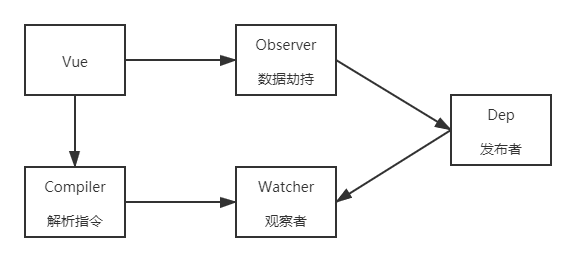

## 模拟实现 Vue 响应式

### 1. 整体分析
#### minivue 的基本结构

- **Vue：**
  - 把 `data` 中的成员注入到 `Vue` 实例，并且把 `data` 中的成员转成 `getter/setter`
- **Observer：**
  - 能够对数据对象的所有属性进行监听，如有变动可拿到最新值并通知 `Dep`
- **Compiler：**
  - 解析每个元素中的指令/插值表达式，并替换成相应的数据
- **Dep：**
  - 添加观察者 `watcher`，当数据变化通知所有观察者
- **Watcher：**
  - 数据变化更新视图

### 2. Vue
